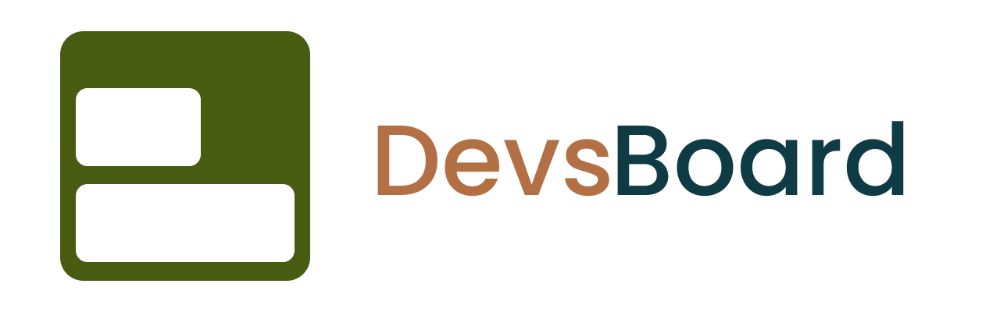

# DevsBoard

### Painel de organização para desenvolvedores

---

## Sobre

**DevsBoard** é uma plataforma web que centraliza a organização do desenvolvedor em um único ambiente.
O objetivo é reduzir o tanto de ferramentas abertas e pesadas e oferecer um **painel simples, rápido, produtivo, leve e centralizado** para acompanhar finanças, tarefas, rotinas, metas e projetos.

Projetado para quem precisa manter **clareza, foco e controle da rotina de desenvolvimento**.

---

## Principais Funcionalidades

### Finanças

* Registro de entradas e despesas
* Categorias e histórico de transações
* Visão geral de saldo e movimentações

### Tarefas

* Organização em formato de **Quadro Kanban**, com interface inspirada no **Trello**
* Separação de tarefas por listas (ex: A fazer, Em andamento, Concluído)
* **Funcionalidade de Drag and drop** completa usando **Dnd kit**, permitindo mover cartões entre listas e reordená-los facilmente
* Sistema de prioridades visual
* Controle de conclusão intuitivo
* Edição e exclusão rápida de tarefas e listas

### Rotinas

* Rotinas diárias, semanais ou mensais
* Estrutura de hábitos recorrentes
* Editar e excluir rotinas
* Filtros
* Criar tarefas internas com as mesmas funcionalidades das tarefas gerais
* Editar tarefas internas
* Funcionalidade de Drag and drop usando Dnd kit

### Metas

* Metas de desempenho
* Metas financeiras com acompanhamento de progresso
* Guardar dinheiro na meta financeira
* Retirar dinheiro da meta financeira
* Progresso automático em porcentagem
* Exibir total acumulado
* Editar e excluir metas

### Projetos

* Registro e documentação de projetos
* Organização de informações essenciais

---

## Stack

**Frontend**

* React
* Vite
* Tailwind CSS
* Framer Motion
* GSAP
* Dnd kit

**Backend**

* Node.js
* Express

**Database**

* Supabase (PostgreSQL)

**Deploy**

* Vercel

---

## Contribuição

Contribuições são bem-vindas.

1. Fork o projeto
2. Crie uma branch (`feature/nova-feature`)
3. Commit suas mudanças
4. Abra um Pull Request

---

Desenvolvido por **IcaroCodes**

